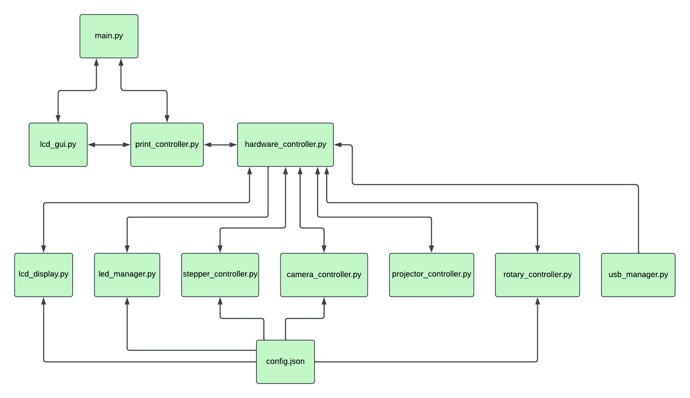

# OpenCAL - an open-source layerless 3d printer

This project contains the software needed to create your own CAL (Computed Axial Lithography) 3d printer which will be a duplicate of the printer that we have made in the advanced manufacturing lab at UC Berkeley. This project is intended for a wide variety of users, with the hope that a less experienced user can get started with minimal changes to any of the actual code although they may need to touch the config file at utils/config.json. 

---

## Table of Contents

1. [Overview](#overview)
2. [Features](#Features)
2. [Installation](#installation)
3. [Usage](#usage)
4. [Configuration](#configuration)

---

## Features
Overview of some features available through the gui
1. Print from usb
2. Edit settings
3. Control stepper and LEDs manually
4. Scale the print size %
5. Kill gui (helps if testing other functions on the pi)

## Overview

This code was written to be run on a raspberry pi 5 without any exterior monitor (although one will be needed for setup) and includes software to operate the printer via a simple gui. At its core, the code sets up communication between all of the physical elements of the printer (stepper, projector, LEDs, gui, camera, usb storage) and coordinates common actions between them, the most important being the ability to print. See the system architecture below for an idea of the files involved and how they are setup to work together.




## Installation

**Prerequisites**:

* Python 3.x

**Steps**:

```bash
# Clone the repo
git clone https://github.com/computed-axial-lithography/OpenCAL.git
cd <repo>

# (Optional) create and activate virtual environment
python3 -m venv venv
source venv/bin/activate

# Install Python dependencies
pip install -r requirements.txt
```
### Running as a systemd service
1. Copy `assets/opencal.service` to `/etc/systemd/system/`
2. Edit the ExecStart path if needed:
   ```ini
   [Service]
   ExecStart=/home/pi/OpenCAL/venv/bin/python /home/pi/OpenCAL/main.py

sudo systemctl daemon-reload
sudo systemctl restart opencal.service
(check status)
sudo systemctl status opencal.service


## Usage

If everything is properly connected and installed, the system can run entirely from the gui. Testing of most of the physical electronics can be done by running the corresponding file in hardware/. Expected sequence for printing:
1. Provide .mp4 via usb storage device
2. Navigate to "Print from USB" on the gui
3. Select .mp4 file for printing
4. Confirm the rotation speed (in rpm) of the resin
5. When print or test is complete, select "stop print"
6. (Optional) review video of print forming, video will be saved to the file location specified in the config.json

## Configuration

The system configuration can be updated by editing the utils/config.json file. 

```yaml
# config.json example
  "rotary_encoder": {
    "clk_pin": 5,
    "dt_pin": 6,
    "btn_pin": 19
  },
```

