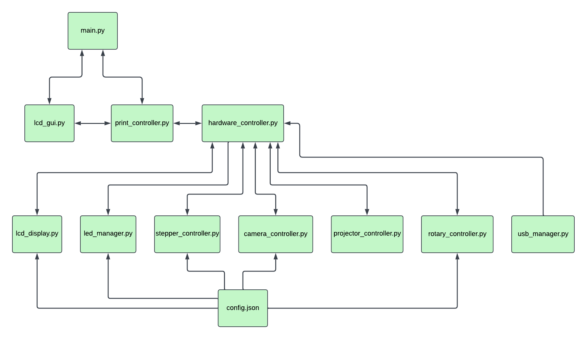

# OpenCAL - an open-source layerless 3d printer

This project contains the software needed to create your own CAL. It depends on Python 3.x and some system libraries; configuration is stored in `utils/config.json`.

---

## Table of Contents

1. [Overview](#overview)
2. [Features](#features)
3. [Installation](#installation)
4. [Configuration](#configuration)
5. [Running as a systemd service](#running-as-a-systemd-service)
6. [Usage](#usage)

---

## Features

Overview of some features available through the GUI:

1. Print from USB
2. Edit settings
3. Control stepper and LEDs manually
4. Scale the print size %
5. Kill GUI (helps if testing other functions on the Pi)

## Overview

This code was written to be run on a Raspberry Pi 5 without any exterior monitor (although one will be needed for setup) and includes software to operate the printer based on the CAL method. All configuration can be tweaked via `utils/config.json`.



## Installation

**Prerequisites**:

* System packages (listed in `apt_requirements.txt`)

**Steps**:

```bash
# Clone the repo
git clone https://github.com/computed-axial-lithography/OpenCAL.git
cd OpenCAL

# Install system dependencies
sudo apt update
xargs sudo apt install -y < apt_requirements.txt

# Create and activate virtual environment
python3 -m venv --use-system-packages
source .venv/bin/activate

# Install Python dependencies
python3 -m pip install -r requirements.txt
```

## Configuration

Edit `utils/config.json` to match your hardware setup. For example:

```json
{
  "rotary_encoder": {
    "clk_pin": 5,
    "dt_pin": 6,
    "btn_pin": 19
  }
}
```

## Running as a systemd service

To have OpenCAL start automatically at boot, register it as a `systemd` service:

1. **Copy the service file**

   ```bash
   sudo cp assets/opencal.service /etc/systemd/system/opencal.service
   ```

2. **Edit the service definition**

   ```bash
   sudo nano /etc/systemd/system/opencal.service
   ```

   Make sure to adjust the `User` and `WorkingDirectory` fields to match your installation. For example, if you cloned into `/home/opencal/OpenCAL` and created a `.venv` there, you might have:

   ```ini
   [Unit]
   Description=OpenCAL 3D Printer Service
   After=network.target

   [Service]
   User=opencal
   WorkingDirectory=/home/opencal/OpenCAL
   ExecStart=/home/opencal/OpenCAL/.venv/bin/python -m opencal
   Restart=on-failure
   ```

3. **Reload, enable, and start**

   ```bash
   sudo systemctl daemon-reload
   sudo systemctl enable opencal.service
   sudo systemctl start opencal.service
   ```

4. **Verify it’s running**

   ```bash
   sudo systemctl status opencal.service
   sudo journalctl -u opencal.service -f
   ```

* **`daemon-reload`** tells `systemd` to re-scan unit files.
* **`enable`** makes it start on every boot; **`start`** fires it now.
* **`status`** shows exit codes and recent logs; **`journalctl -f`** follows live output so you can spot errors immediately.

## Usage

If everything is properly connected and installed, the system can run entirely from the GUI. Expected sequence for printing:

1. Provide `.mp4` via USB storage device.
2. Navigate to "Print from USB" on the GUI.
3. Select `.mp4` file for printing.
4. Confirm the rotation speed (in rpm) of the resin (should be 9 for provided video).
5. Start the print or test.
